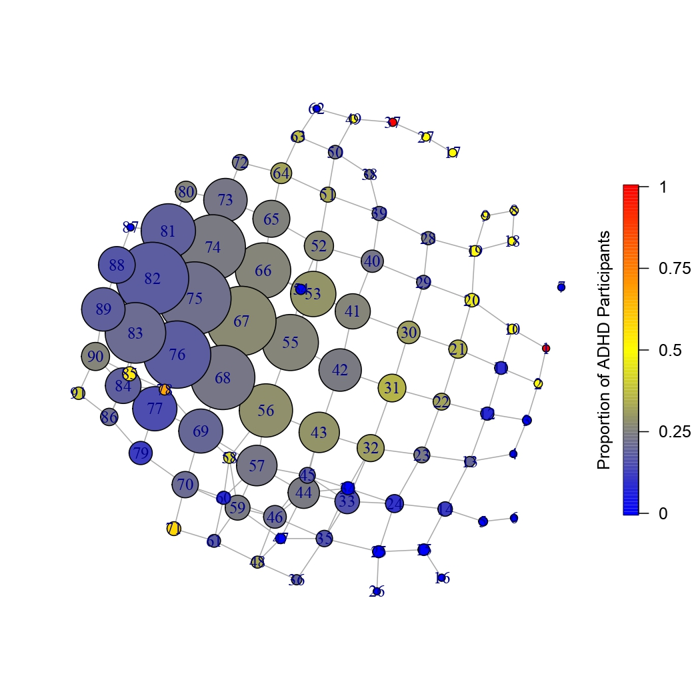

This repository contains the process of applying topological data analysis (the Mapper algorithm) on the [Open-Play dataset](https://github.com/digital-wellbeing/open-play).
Specifically, we explore mental wellbeing and the fulfilment games bring,
to people with varying levels of attention deficit hyperactivity disorder (ADHD).

Previous work reproducing academic research that utilise Mapper are also found here (under examples),
as well as attempt to implement the Mapper algorithm from scratch in R.

