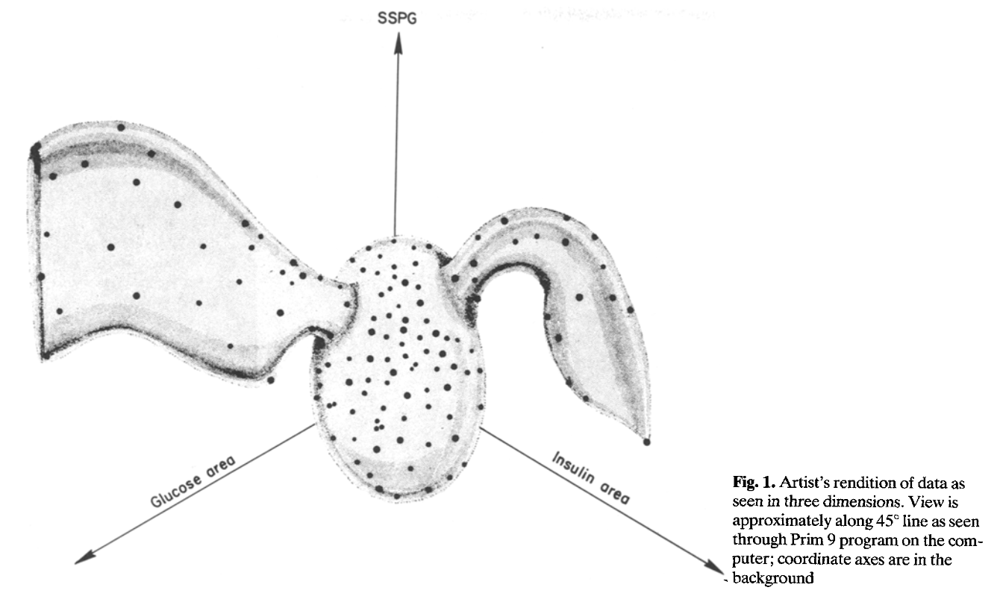

This notebook experiments with the Mapper algorithm on the Reaven-Miller diabetes dataset.
This dataset is relatively small (145 rows and 6 variables).
It is known to have a flare structure (highlighted below from the original paper) based on three variables: SSPG, Glucose area, and insulin area.



```{r setup, echo=FALSE, results=FALSE}
library(rrcov)
library(ggplot2)
library(GGally)
library(mappeR)
library(igraph)
library(visNetwork)
library(htmlwidgets)
library(RColorBrewer)

# helper functions for mapper construction
mapper_files <- list.files(file.path("mapper"), full.names = TRUE)
for (file in mapper_files) {
  source(file)
}
```

```{r data_init}
data(diabetes)
raw_data <- diabetes[, 1:5]
raw_scaled <- data.frame(scale(raw_data))
groups <- diabetes$group
```


```{r dataset_plot, results='hide', fig.width=10, fig.height=5}
ggpairs(diabetes, columns = 1:5, aes(colour = group))
```

# Original Mapper Experiment
This section attempts to follow the Mapper graphs from Singh et al. 2007 in the introductory paper of Mapper.
There, they created two variants: a low-resolution Mapper with 3 intervals and 50% overlap, and a high-resolution with 4 intervals 50% overlap.
The paper also used a density estimation as the filter function, and a gap heuristic as part of the clustering method (single-linkage hierarchical clustering, with a threshold based on the first gap in the filter histogram, with $k$ bins).

After multiple adjustments to the epsilon of the density estimations, the $k$ bins, it was difficult to show the hidden structure.
In the following visualisation, the colour represents varying densities in the data (low=blue, high=red).

## Low-resolution Mapper
```{r low_res, fig.width=15, fig.height=6}
# low-resolution mapper from Singh et al. 2007
# euclidean distance matrix
d_matrix <- as.matrix(dist(raw_scaled, method = "euclidean"))
density_est <- density_estimation(d_matrix)
density_lens <- density_est$lens
cat("Density epsilon: ", density_est$epsilon)

pct_overlap <- 50
nintervals <- 3

intervals <- create_fixed_intervals(
  density_lens,
  nintervals,
  pct_overlap
)

mapper <- compute_mapper_1d(
  distances = d_matrix,
  filter_values = density_lens,
  intervals = intervals,
  pruning = FALSE,
  clustering = cluster_gap_heuristic,
  # clustering parameters
  k_bins = 15
)
graph <- create_mapper_graph(
  mapper_obj = mapper,
  lens = density_lens,
  original_data = diabetes,
  groups = list(
    cat_var = "group",
    cat_colour = brewer.pal(length(unique(diabetes$group)), "Set1")
  )
)
plot(graph, layout = layout_with_kk(graph))

# create interactive graph
vis_graph <- create_vis_graph(
  graph = graph, 
  mapper_obj = mapper,
  original_data = diabetes
) |>
  add_continuous_legend(
    title = "Density Lens (Filter)",
    colours = c("blue", "yellow", "red"),
    labels = c("Low Density", "High Density")
  )

vis_graph
```

### Visualising the Density Estimator
This is to get a better understanding of the application of this filter function.
```{r}
hist(density_est$lens)

data_pca <- prcomp(raw_scaled, center = TRUE)
pca_plot <- ggplot(mapping = aes(data_pca$x[, 1], data_pca$x[, 2], colour = density_lens)) +
  geom_point() +
  labs(
    title = "Principal Components (83% total variance)",
    x = "PC1 (55%)",
    y = "PC2 (28%)"
  ) +
  scale_color_viridis_c()
pca_plot
```

```{r}
dist_matrix <- as.matrix(d_matrix)
print("Distance metrics for row 1:")
print(dist_matrix[1,])
plot(density(dist_matrix[1,]))

d_matrix_sq <- dist_matrix^2
print("Squared distances for row 1:")
print(d_matrix_sq[1,])
plot(density(d_matrix_sq[1,]))

epsilon = 8

# if epsilon is not provided, use the median heuristic
if (is.null(epsilon)) {
  # median of the upper triangle to avoid the 0s on the diagonal
  epsilon <- median(d_matrix_sq[upper.tri(d_matrix_sq)])
}

points <- seq(-10, 10, length.out = 100)
density_curve <- data.frame(x = points, y = sapply(points, function(x) exp(-(x^2) / epsilon)))
plot(density_curve, type = "l")
kernel_matrix <- exp(-d_matrix_sq / epsilon)

print("Density estimation for row 1:")
print(kernel_matrix[1,])
plot(kernel_matrix[1,], main = "Density estimations to other datapoints from point 1")
plot(kernel_matrix[1,], type = "l", main = "Kernel density estimations")
# maybe need to calculate the constant for correct integral
density_estimates <- rowSums(kernel_matrix)
cat("Total density estimation for data point one: ", density_estimates[1], "\n")
plot(density_estimates)
```


## High-resolution Mapper
```{r high_res, fig.width=15, fig.height=6}
# high-resolution mapper from Singh et al. 2007
density_est <- density_estimation(d_matrix, epsilon = 8)
density_lens <- density_est$lens
cat("Density epsilon (high-res): ", density_est$epsilon)

pct_overlap <- 50
nintervals <- 4

intervals <- create_fixed_intervals(
  density_lens,
  nintervals,
  pct_overlap
)

mapper <- compute_mapper_1d(
  distances = d_matrix,
  filter_values = density_lens,
  intervals = intervals,
  pruning = FALSE,
  clustering = cluster_gap_heuristic,
  # clustering parameters
  k_bins = 10
)
graph <- create_mapper_graph(
  mapper_obj = mapper,
  lens = density_lens,
  original_data = diabetes,
  groups = list(
    cat_var = "group",
    cat_colour = brewer.pal(length(unique(diabetes$group)), "Set1")
  )
)

# create interactive graph
vis_graph <- create_vis_graph(
  graph = graph, 
  mapper_obj = mapper,
  original_data = diabetes
) |>
  add_continuous_legend(
    title = "Density Lens (Filter)",
    colours = c("blue", "yellow", "red"),
    labels = c("Low Density", "High Density")
  )

vis_graph
```

Increasing the number of intervals yielded better results.
In this case, it appears the number of intervals is essential for extracting key structure.

## Various Distance Metrics
The previous examples used Euclidean distances, which is the most common and intuitive metric for between-point distances.

### Cosine Distance
```{r}
cos_dist <- cosine_distance(raw_scaled)
density_est <- density_estimation(cos_dist, epsilon = 8)
density_lens <- density_est$lens
cat("Density epsilon (high-res): ", density_est$epsilon)

pct_overlap <- 50
nintervals <- 4

intervals <- create_fixed_intervals(
  density_lens,
  nintervals,
  pct_overlap
)

mapper <- compute_mapper_1d(
  distances = cos_dist,
  filter_values = density_lens,
  intervals = intervals,
  pruning = FALSE,
  clustering = cluster_gap_heuristic,
  # clustering parameters
  k_bins = 10
)
graph <- create_mapper_graph(
  mapper_obj = mapper,
  lens = density_lens,
  original_data = diabetes,
  groups = list(
    cat_var = "group",
    cat_colour = brewer.pal(length(unique(diabetes$group)), "Set1")
  )
)

# create interactive graph
vis_graph <- create_vis_graph(
  graph = graph, 
  mapper_obj = mapper,
  original_data = diabetes
) |>
  add_continuous_legend(
    title = "Density Lens (Filter)",
    colours = c("blue", "yellow", "red"),
    labels = c("Low Density", "High Density")
  )

vis_graph
```
Cosine distance (using the similarity) focuses on the angle/shape of the data points rather than their magnitude. This loses the dense cluster we know is there, and produces a poor Mapper graph.

### Manhattan Distance
```{r}
man_dist <- dist(raw_scaled, method = "manhattan")
density_est <- density_estimation(man_dist)
density_lens <- density_est$lens
cat("Density epsilon (high-res): ", density_est$epsilon)

pct_overlap <- 50
nintervals <- 4

intervals <- create_fixed_intervals(
  density_lens,
  nintervals,
  pct_overlap
)

mapper <- compute_mapper_1d(
  distances = man_dist,
  filter_values = density_lens,
  intervals = intervals,
  pruning = FALSE,
  clustering = cluster_gap_heuristic,
  # clustering parameters
  k_bins = 10
)
graph <- create_mapper_graph(
  mapper_obj = mapper,
  lens = density_lens,
  original_data = diabetes,
  groups = list(
    cat_var = "group",
    cat_colour = brewer.pal(length(unique(diabetes$group)), "Set1")
  )
)

# create interactive graph
vis_graph <- create_vis_graph(
  graph = graph, 
  mapper_obj = mapper,
  original_data = diabetes
) |>
  add_continuous_legend(
    title = "Density Lens (Filter)",
    colours = c("blue", "yellow", "red"),
    labels = c("Low Density", "High Density")
  )

vis_graph
```

Noticeably, we get a poorer graph when we use smaller epsilon, which attempts to make tighter clusters.

### Pearson Correlation
Specifically, I will try the pearson distance correlation $1 - \rho$.
A value of 0 means a perfect correlation, 1 means no correlation, and 2 means perfect negative correlation.
This matches the idea that the distance metric shows dissimilarity the larger the value.
```{r}
p_dist <- as.matrix(pearson_distance(raw_data))
density_est <- density_estimation(p_dist)
density_lens <- density_est$lens
cat("Density epsilon (high-res): ", density_est$epsilon)

pct_overlap <- 50
nintervals <- 3

intervals <- create_fixed_intervals(
  density_lens,
  nintervals,
  pct_overlap
)

mapper <- compute_mapper_1d(
  distances = p_dist,
  filter_values = density_lens,
  intervals = intervals,
  pruning = FALSE,
  clustering = cluster_gap_heuristic,
  # clustering parameters
  k_bins = 10
)
graph <- create_mapper_graph(
  mapper_obj = mapper,
  lens = density_lens,
  original_data = diabetes,
  groups = list(
    cat_var = "group",
    cat_colour = brewer.pal(length(unique(diabetes$group)), "Set1")
  )
)
# plot(graph, layout = layout_with_kk(graph))

# create interactive graph
vis_graph <- create_vis_graph(
  graph = graph, 
  mapper_obj = mapper,
  original_data = diabetes
) |>
  add_continuous_legend(
    title = "Density Lens (Filter)",
    colours = c("blue", "yellow", "red"),
    labels = c("Low Density", "High Density")
  )

vis_graph
```

Now I will use a PCA of the first 2 components:
```{r}
p_dist <- as.matrix(pearson_distance(raw_data))
pca <- prcomp(raw_data, center = TRUE, scale. = TRUE)
# try two principal components once I am happy with the code
lens <- pca$x[, 1]

pct_overlap <- 50
nintervals <- 3

intervals <- create_fixed_intervals(
  lens,
  nintervals,
  pct_overlap
)

mapper <- compute_mapper(
  distances = p_dist,
  filter_values = lens,
  intervals = intervals,
  pruning = FALSE,
  clustering = cluster_gap_heuristic,
  # clustering parameters
  k_bins = 10
)
graph <- create_mapper_graph(
  mapper_obj = mapper,
  lens = lens,
  original_data = diabetes,
  groups = list(
    cat_var = "group",
    cat_colour = brewer.pal(length(unique(diabetes$group)), "Set1")
  )
)
plot(graph, layout = layout_with_kk(graph))

# create interactive graph
vis_graph <- create_vis_graph(
  graph = graph, 
  mapper_obj = mapper,
  original_data = diabetes
) |>
  add_continuous_legend(
    title = "Density Lens (Filter)",
    colours = c("blue", "yellow", "red"),
    labels = c("Low Density", "High Density")
  )

# vis_graph
```

Now I will try using the standard angular distance
$$
d_\theta = \sqrt{\frac{1-\rho}{2}}
$$
This follows all valid metric requirements, and is in the range [0, 1].
0 means perfect positive correlation, 0.5 is no correlation, and 1 is perfect negative correlation.
```{r}

```

# Newer Experiments

In Fitzpatrick et al. 2026, whilst demonstrating their new method for interpreting Mapper, they trialed different parameters (not exhaustively listed) and settled on a density estimation, ward hierarchical clustering, 8 filters, and 40% overlap.

```{r fitzpatrick_mapper, fig.width=15, fig.height=6}
# same epsilon as before
euc_dist <- dist(raw_scaled, method = "euclidean")
density_est <- density_estimation(euc_dist, epsilon = 8)
density_lens <- density_est$lens

pct_overlap <- 50
nintervals <- 8

intervals <- create_fixed_intervals(
  density_lens,
  nintervals,
  pct_overlap
)

mapper <- compute_mapper_1d(
  distances = euc_dist,
  filter_values = density_lens,
  intervals = intervals,
  pruning = FALSE,
  clustering = cluster_hierarchical_ward,
  height_threshold = NULL, # 70% max height
)
graph <- create_mapper_graph(
  mapper_obj = mapper,
  lens = density_lens,
  original_data = diabetes,
  groups = list(
    cat_var = "group",
    cat_colour = brewer.pal(length(unique(diabetes$group)), "Set1")
  )
)

# create interactive graph
vis_graph <- create_vis_graph(
  graph = graph, 
  mapper_obj = mapper,
  original_data = diabetes
) |>
  add_continuous_legend(
    title = "Density Lens (Filter)",
    colours = c("blue", "yellow", "red"),
    labels = c("Low Density", "High Density")
  )

vis_graph
```

When compared with the 4 intervals used previously in the *high-resolution* graph, we can see ward clustering appears to make more sense of the structure: two higher density ends, branching off into less dense nodes.
Ward's clustering initially treats each point as its own cluster, and merges the closest pair of clusters that have the smallest increase in within-cluster variance (Euclidean squared distance)

```{r high_res_ward, fig.width=15, fig.height=6}
# the high-res Singh et al. model, with Ward clustering
euc_dist <- dist(raw_scaled, method = "euclidean")
density_est <- density_estimation(euc_dist, epsilon = 8)
density_lens <- density_est$lens

pct_overlap <- 50
nintervals <- 4

intervals <- create_fixed_intervals(
  density_lens,
  nintervals,
  pct_overlap
)

mapper <- compute_mapper_1d(
  distances = euc_dist,
  filter_values = density_lens,
  intervals = intervals,
  pruning = FALSE,
  clustering = cluster_hierarchical_ward,
  height_threshold = NULL, # 70% max height
)
graph <- create_mapper_graph(
  mapper_obj = mapper,
  lens = density_lens,
  original_data = diabetes,
  groups = list(
    cat_var = "group",
    cat_colour = brewer.pal(length(unique(diabetes$group)), "Set1")
  )
)

# create interactive graph
vis_graph <- create_vis_graph(
  graph = graph, 
  mapper_obj = mapper,
  original_data = diabetes
) |>
  add_continuous_legend(
    title = "Density Lens (Filter)",
    colours = c("blue", "yellow", "red"),
    labels = c("Low Density", "High Density")
  )

vis_graph
```